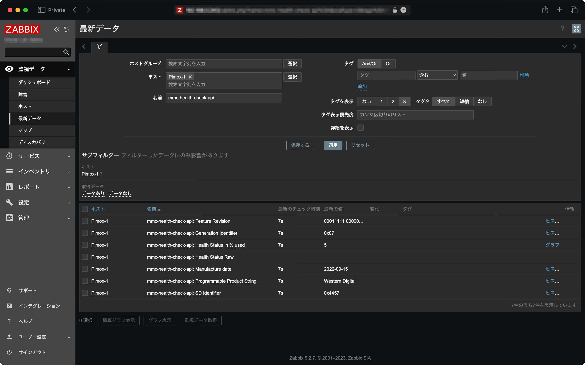

# Zabbix MMC Health Check API

SanDisk and WesternDigital microSD health check API for Zabbix

## Installation

### Agent

- Install `mmc-utils` built after 2022-04-26.
  - If you are currently using Raspbery Pi OS, add the unstable or testing Debian repository and install `mmc-utils`.
- Add the user and command to sudoers so that `mmc gen_cmd read` can be executed by the user running this server.
- Create SSL Certificate and preshared key file.
- Build `main.go`
- Set to run at startup.

### Zabbix Server

- Import the template.
- Set a preshared key in the macro `{$MMC.PSK}` when add the template to the host.

## Testing environment

Raspberry Pi 4 Model B 4GB with [WD Purple SC QD101 microSD card 32GB](https://www.westerndigital.com/ja-jp/products/memory-cards/wd-purple-microsd)

## References

- [SanDisk Industrial microSD Card Datasheet](https://images-na.ssl-images-amazon.com/images/I/91tTtUMDM3L.pdf)
- [mmc/mmc-utils.git - Unnamed repository; edit this file 'description' to name the repository.](https://git.kernel.org/pub/scm/utils/mmc/mmc-utils.git/log/)

